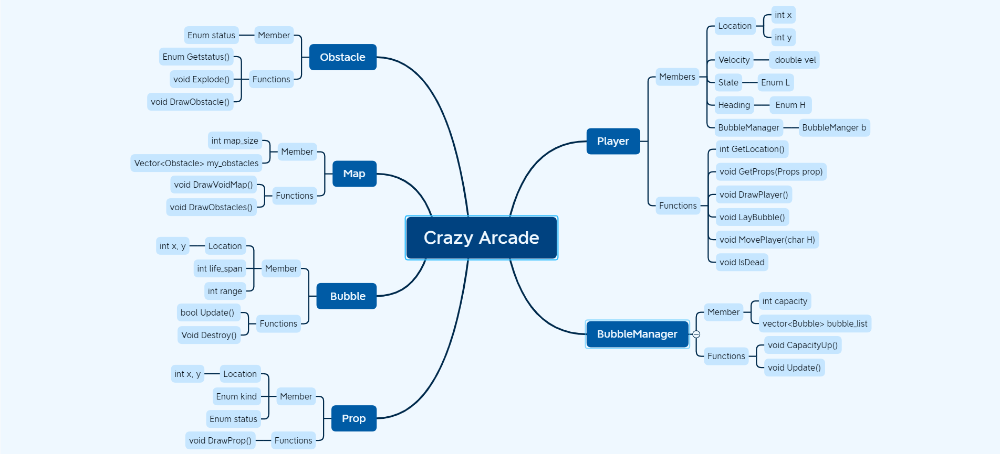
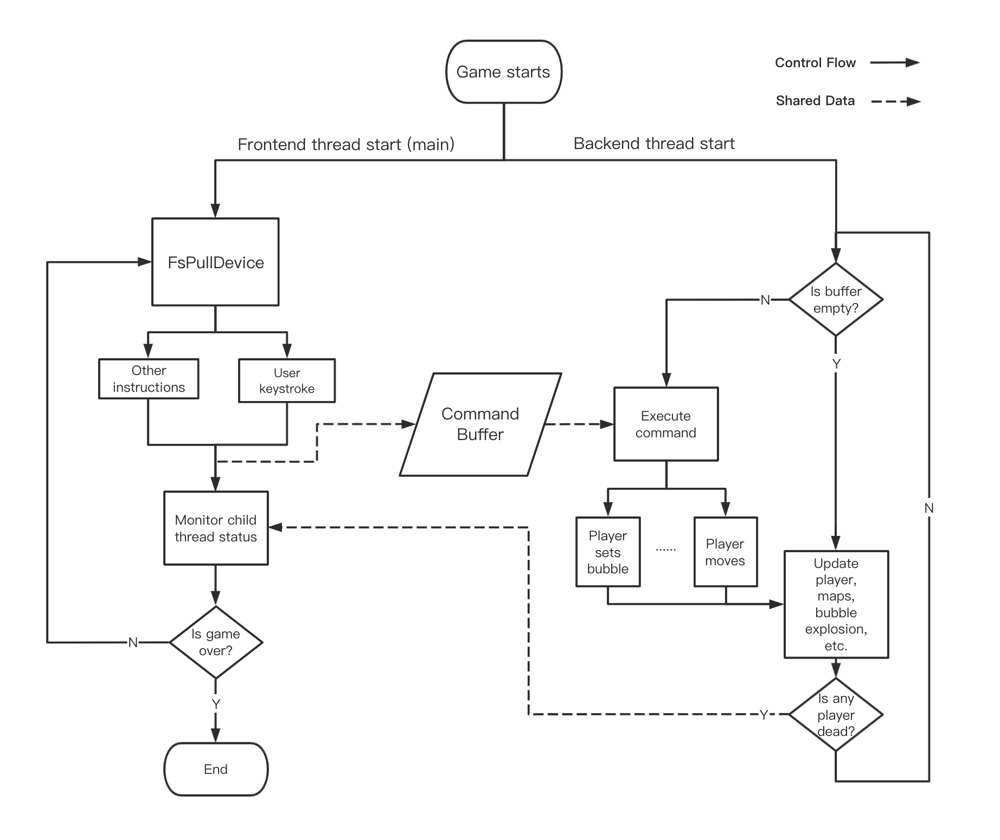

# CrazyArcade

### Overview
@todo

### Install
* **Mac**
    ```
    ./install-mac.sh -p ../Some_Path
    ```
    Change `../Some_Path` to your own project path which contains YS library files.
* **Win** 
    Based on the test on Visual Studio 2019 Community version.
    First, create a new project and the use Console App for project. 
    Second, remove default file and copy everything under `/Src_Win, /Inc_Win, /Ext_Win, /Data/Map, /Data/Music` folder from original path to `Your_Path_To_New_Project_File_Folder`.
    Third, press `Shift+Alt+A` or use project->add existing item function to add all copied files into current project.
    Last, run `main.cpp` to start the program.
    

### Construction


### Flow


#### TODO
* Zhengyang: `Player`
* Yiping: `Obstacles` and `Props`
* Dijing: `Bubble` and `BubbleManager`
* Jiajun: `Map`
* Chengji: Flow control
