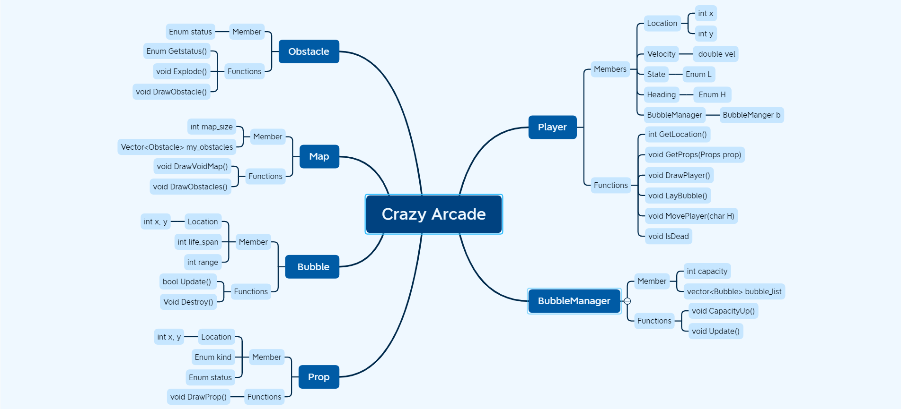
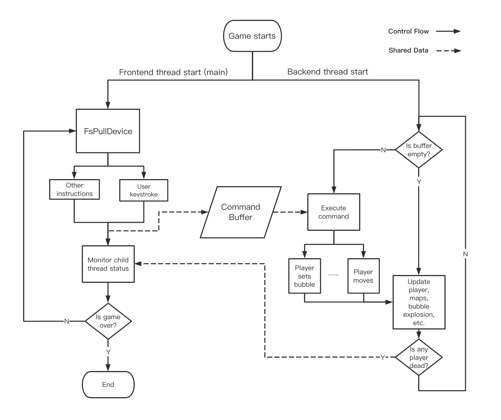

# CrazyArcade

### Overview
@todo

### Construction

### Flow

#### TODO
* Zhengyang: `Player`
* Yiping: `Obstacles` and `Props`
* Dijing: `Bubble` and `BubbleManager`
* Jiajun: `Map`
* Chengji: Flow control